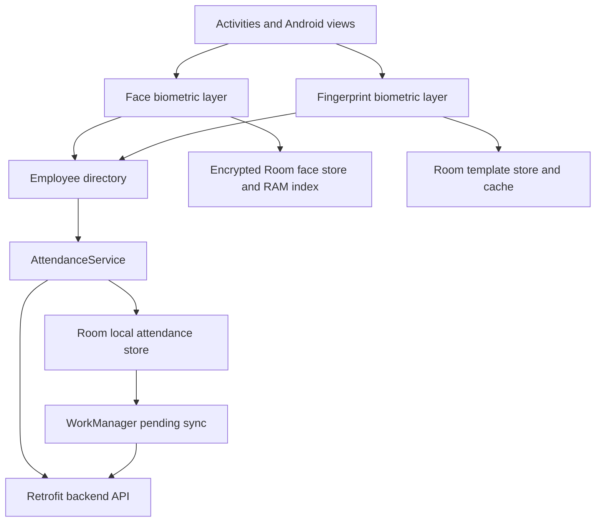
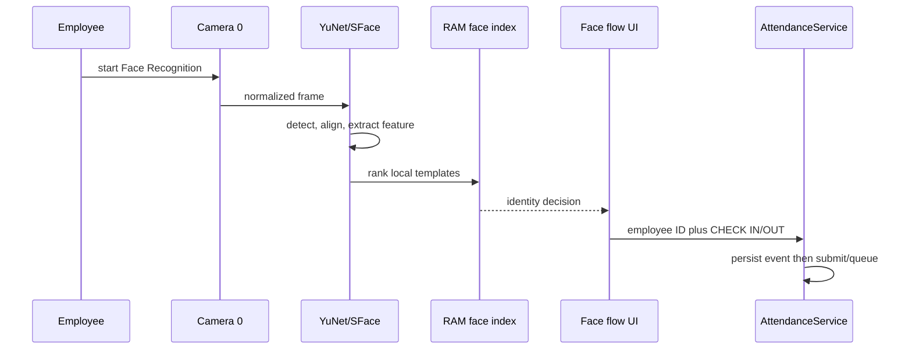
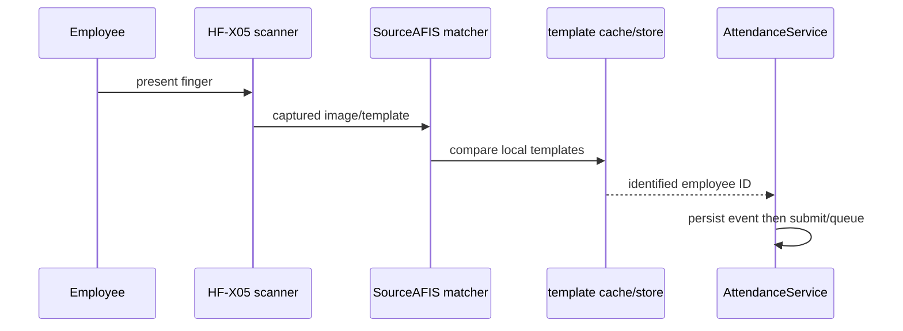
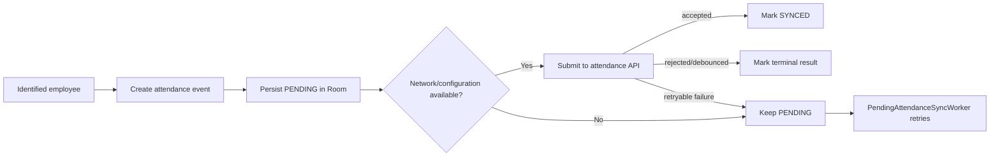

# Architecture

The application is a single Android module organized by feature packages. Face and fingerprint flows identify an employee, then hand off to the shared attendance domain. Existing product/background context is in [docs/codex/ARCHITECTURE.md](codex/ARCHITECTURE.md) and backend details are in [docs/codex/BACKEND_CONTRACTS.md](codex/BACKEND_CONTRACTS.md).

## Components

- **UI:** Activities including `MainActivity`, `FingerprintScanActivity`, `FingerprintRegistrationActivity`, `FingerprintManagementActivity`, `EmployeeBiometricManagementActivity`, face scan/flow/registration activities, admin activities, and `AttendanceActivity`.
- **Face:** `Hfx05DualFaceCamera`, `FaceDetectionRunner`, `YuNetFaceDetectorAdapter`, `SFaceFeatureExtractorAdapter`, `FaceTemplateIndexManager`, `LocalFaceEnrollmentRepository`, and face backup/sync services. The verified hardware path is Camera 0 at physical orientation 90 degrees, with YuNet detection and SFace extraction.
- **Fingerprint:** `Hfx05FingerprintScanner`/`Hfx05NativeBridge`, `FingerprintEnrollmentService`, `SourceAfisFingerprintMatcher`, `IdentificationService`, `LocalBiometricRepository`, `BiometricTemplateCache`, and `FingerprintBackupService`.
- **Attendance/domain:** `AttendanceService` inserts a durable event before an online attempt. `LocalAttendanceRepository` persists it; `PendingAttendanceSyncWorker` retries pending events through WorkManager.
- **Employee data:** `LocalEmployeeDirectory` and `EmployeeDirectoryDatabase` persist employee records and attendance events. `EmployeeSyncService` obtains current employee data from the backend.
- **Network/configuration:** `FingerprintApiClient` creates Retrofit API access through `FingerprintApiService`; `BackendEnvironmentConfig` reads generated BuildConfig values. `DeviceConfigurationRepository` provides local device configuration/ID.

## Face attendance sequence

## Fingerprint attendance sequence

## Shared attendance processing

## Boundaries that must remain intact

- Biometric code identifies an employee; `AttendanceService` owns attendance submission and pending-event behavior.
- Face local persistence uses Android-Keystore protection plus Room. Its portable template backups are not Keystore ciphertext; restore validates then encrypts locally and refreshes the RAM index.
- The fingerprint scanner’s GPIO/SPI/reset/native capture lifecycle is protected HF-X05 code and requires physical-device testing.
- NFC and iris are not implemented attendance methods in the current app.
